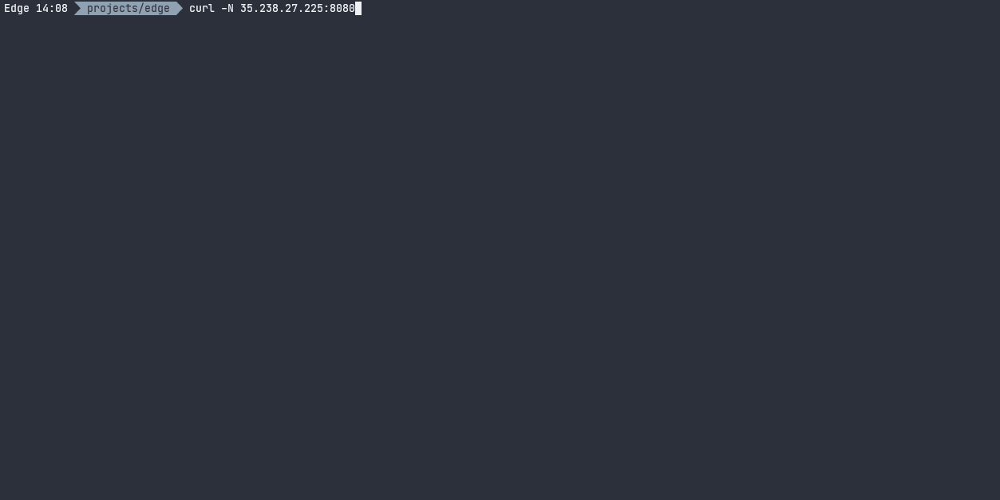

## Growth Hack 2020 - Big Data
Welcome! As now we know, not strictly Big Data, but we'll learn some tools that make Data Engineers' life easier (and everyone working with data).

## Working in the terminal
The engineers' day-to-day happens in the terminal, may look scary but is hella fun!

### Opening a terminal
In case you have `WSL`, `Git Bash` or `term` or `iterm` if working on a Mac, you can use those.
Otherwise let's open an online one
#### [https://repl.it/languages/bash](https://repl.it/languages/bash)

### Getting to know the terminal
You will see a prompt like this
```
>
```
Type a command and hit <kbd>Enter</kbd> to execute it.

##### Tip: you can copy and the paste the commands in the online terminal using <kbd>Ctrl</kbd>+<kbd>Shift</kbd>+<kbd>v</kbd>

For example, this one to show all the content of the current folder
```
ls -als
```
Or just this one to print a greeting
```
echo Hola!
```

## Unix Pipes
Unix pipes are are mechanisms to transform and communicate data between processes, similar to what Data Engineers do in the Cloud systems.
The pipe is set using the `|` symbol.

### Your first pipe
Let's print a message like we did before, but before printing pipe it to another process
1. Echo the message
2. Pass it to a pipe `|`
3. Let the pipe send it to `tr` which will transform it into uppercase
```
echo Hola! | tr a-z A-Z
```
Congratulations! You're ready to get some serious action!

## Working with Text data
### Getting some data
Execute the command below to bring a copy of *Alice Through the Looking-Glass by Lewis Carroll*
```
curl -sN https://www.gutenberg.org/files/12/12-0.txt
```

Woa, that was actually too fast.
Let's pipe it through the counter `wc` to see how many lines we have in total
```
curl -sN https://www.gutenberg.org/files/12/12-0.txt | wc -l
```

### Start the tweaking - Understanding word frequency
Let's calculate how many times each word appears in the text, for that we'll need to do some processing before

First, remove the punctuation by using our friend `tr`
```
curl -sN https://www.gutenberg.org/files/12/12-0.txt | tr -d '[:punct:]' | tr -d '’'
```

I like where we're getting.   
Now is time to count the word frequency, we have a tool in our toolbox that allows to count lines, now just if each word was in a single line...  
Let's replace all spaces with new line jumps :D
```
curl -sN https://www.gutenberg.org/files/12/12-0.txt | tr -d '[:punct:]' | tr -d '’' | tr '[:space:]' '[\n*]'
```

To make it more interest let's sort it
```
curl -sN https://www.gutenberg.org/files/12/12-0.txt | tr -d '[:punct:]' | tr -d '’' | tr '[:space:]' '[\n*]' | sort
```

Now let's count it
```
curl -sN https://www.gutenberg.org/files/12/12-0.txt | tr -d '[:punct:]' | tr -d '’' | tr '[:space:]' '[\n*]' | sort | uniq -c
```

Not what we expected, every day problems.   
Let's fix it with some syntactic sugar.  
Swap the number and word spot using our friend `awk`, then sort.  
```
curl -sN https://www.gutenberg.org/files/12/12-0.txt | tr -d '[:punct:]' | tr -d '’' | tr '[:space:]' '[\n*]' | sort | uniq -c | awk '{print $2" "$1}'
```

It's looking better, now let's sort it by frequency
If we ommit `-nr` it's sorted lexicographically
```
curl -sN https://www.gutenberg.org/files/12/12-0.txt | tr -d '[:punct:]' | tr -d '’' | tr '[:space:]' '[\n*]' | sort | uniq -c | sort -nr
```

And where's the bandersnatch?
```
curl -sN https://www.gutenberg.org/files/12/12-0.txt | tr -d '[:punct:]' | tr -d '’' | tr '[:space:]' '[\n*]' | sort | uniq -c | sort -nr
```

## Working with streaming data
### Getting some data
You should see something like this

